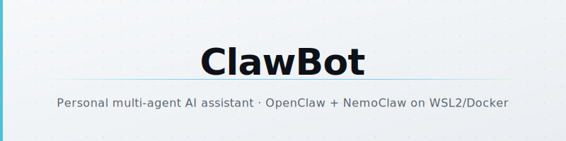
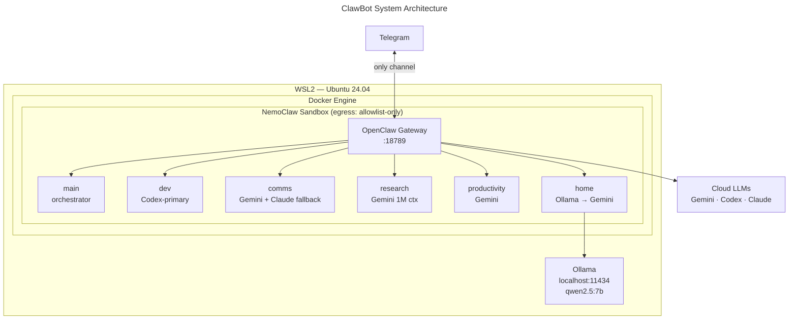

<!-- To use your own logo: replace the SVG files in assets/ or add a logo image to the <picture> sources -->
<p align="center">
  <picture>
    <source media="(prefers-color-scheme: dark)" srcset="./assets/banner-dark.svg">
    <source media="(prefers-color-scheme: light)" srcset="./assets/banner-light.svg">
    
  </picture>
</p>

<p align="center">
  <a href="LICENSE"></a>
  
  
  
</p>

<p align="center"><strong>Always-on, locally-hosted AI agent system — six specialized agents, sandboxed by NemoClaw, controlled via Telegram.</strong></p>

---

<details>
<summary>Table of Contents</summary>

- [About](#about)
- [Architecture](#architecture)
- [Agents](#agents)
- [Model Strategy](#model-strategy)
- [Quick Start](#quick-start)
- [Configuration](#configuration)
- [Security Policy](#security-policy)
- [Phased Roadmap](#phased-roadmap)
- [Anti-Patterns](#anti-patterns)

</details>

## About

ClawBot is a personal, always-on multi-agent AI assistant running [OpenClaw][openclaw] inside an [NVIDIA NemoClaw][nemoclaw] sandbox on Windows/WSL2. It is **not** a SaaS product, not a custom fork — this is configuration-only customization of upstream OpenClaw, hardened with enterprise-grade sandboxing for a system that has access to email, code repos, and home automation.

Six specialized agents handle different domains (dev work, communications, research, productivity, home automation), each with its own model assignment and behavioral constraints. All interaction flows through Telegram. Nothing sends without your explicit approval.

> [!IMPORTANT]
> This repo contains configuration, scripts, and agent definitions — not a deployable binary. You need an existing WSL2/Docker environment, OpenClaw, and NemoClaw installed before any of this applies. Run `scripts/00-preflight.sh` through `scripts/09-verify-phase1.sh` sequentially to validate your environment.

## Architecture



**Host:** Windows + WSL2 (Ubuntu 24.04) · **GPU:** 2× GTX 1070 Ti (Pascal — local inference capped at ≤7B quantized) · **Gateway port:** 18789

## Agents

| Agent | Primary Model | Fallback | Role |
|-------|--------------|----------|------|
| `main` | gemini-3-flash | gpt-5.4 (Codex) | Orchestrator — routes messages to specialized agents |
| `dev` | gpt-5.4 (Codex OAuth) | gemini-3-flash | Code review, PR triage, CI/CD monitoring, debugging |
| `comms` | gemini-3-flash | claude-sonnet-4-6 | Email triage, draft generation, Gmail integration |
| `research` | gemini-3-flash | — | Web research, document analysis, Obsidian vault search |
| `productivity` | gemini-3-flash | gpt-5.4 | Calendar management, morning briefings, task tracking |
| `home` | qwen2.5:7b (Ollama) | gemini-3-flash | Home Assistant control, device status |

Each agent has its own `SOUL.md` defining personality, capabilities, and behavioral constraints. Agents cannot modify their own `SOUL.md`, config, or auth credentials.

### Key Behavioral Constraints

- **Comms agent** — never auto-sends email; every outbound action requires explicit Telegram confirmation
- **Home agent** — confirms all destructive actions (locks, alarms, cameras) before executing
- **All agents** — cannot modify their own config or auth

## Model Strategy

Gemini 3 Flash is the bulk workhorse (70–80% of all requests) via the free tier API key — not subscription OAuth. Codex is reserved exclusively for the dev agent due to its 5hr/week quota on ChatGPT Plus. Claude Sonnet is the on-demand fallback for nuanced writing, budget-capped at $30/month.

| Priority | Provider | Model | Auth | Role |
|----------|----------|-------|------|------|
| 1 | Google Gemini | gemini-3-flash | API key (AI Studio) | Default for all agents — free tier, 1M context |
| 2 | OpenAI Codex | gpt-5.4 | Codex OAuth (ChatGPT Plus) | Dev agent only — 5hr/week quota |
| 3 | Anthropic | claude-sonnet-4-6 | API key | Complex reasoning, nuanced prose — $30/mo cap |
| 4 | Ollama | qwen2.5:7b | Local | Heartbeats, trivial classification — never cloud |
| — | OpenAI | text-embedding-3-small | API key | Embeddings for memory/search |

> [!WARNING]
> Do not use Claude subscription OAuth tokens or Google AI Ultra OAuth in OpenClaw — both violate provider ToS and have resulted in account restrictions. Use API keys only.

**Estimated monthly cost (steady state):** $0–40, mostly within free tiers.

## Quick Start

> [!IMPORTANT]
> Requires WSL2 (Ubuntu 24.04), Docker Engine (not Docker Desktop), Node.js 22+, NemoClaw, and OpenClaw already installed. Pascal-generation GPUs (GTX 1070 Ti) cannot run models larger than 7B quantized.

**1. Copy the env template and fill in your API keys:**

```bash
cp .env.example .env
# Edit .env — add GEMINI_API_KEY, ANTHROPIC_API_KEY, OPENAI_API_KEY, TELEGRAM_BOT_TOKEN
```

**2. Run the Phase 1 setup scripts sequentially in WSL2:**

```bash
bash scripts/00-preflight.sh
bash scripts/01-wsl2-docker.sh
# ... continue through ...
bash scripts/09-verify-phase1.sh
```

Script `09` validates all 14 Phase 1 exit criteria. A passing run means your single `main` agent is online, responding via Telegram, with the full fallback chain (Gemini → Codex → Claude) operational.

**3. Send a message to your bot on Telegram:**

```
hello
```

You should receive a coherent response routed through Gemini.

> [!TIP]
> Use `/dev`, `/comms`, `/research`, `/home`, or `/tasks` prefixes in Telegram to explicitly route to a specific agent, bypassing main's auto-routing.

## Configuration

### File Layout

```
clawbot/
├── .env.example              # API keys template — copy to .env, never commit .env
├── CLAUDE.md                 # Full architecture reference and tech stack decisions
├── prd-openclaw-nemoclaw.md  # PRD, phased delivery plan, success metrics
├── scripts/                  # 00–09: run sequentially in WSL2 to bootstrap
├── config/
│   ├── openclaw.json5        # Multi-agent config — model routing, heartbeats, agentToAgent
│   └── openclaw-sandbox.yaml # NemoClaw egress allowlist policy
├── agents/
│   └── {main,dev,comms,research,productivity,home}/
│       ├── SOUL.md           # Agent personality, capabilities, behavioral constraints
│       └── AGENTS.md         # Agent-specific config notes
└── docs/
    └── phase1-checklist.md
```

### Key Config Files

**`config/openclaw.json5`** — defines all 6 agents, their model assignments, fallback chains, heartbeat schedules, and `agentToAgent` delegation rules.

**`config/openclaw-sandbox.yaml`** — NemoClaw egress policy. Default-deny with an allowlist covering LLM provider APIs, Google Workspace, Telegram, GitHub, npm/PyPI, and Ollama on localhost.

### Environment Variables (`.env`)

| Variable | Required | Notes |
|----------|----------|-------|
| `GEMINI_API_KEY` | Yes | From Google AI Studio — free tier |
| `ANTHROPIC_API_KEY` | Yes | From console.anthropic.com — pay-per-token |
| `OPENAI_API_KEY` | Yes | For embeddings only — separate from Codex OAuth |
| `TELEGRAM_BOT_TOKEN` | Yes | From @BotFather |
| `GITHUB_PAT` | Phase 2 | Fine-grained PAT scoped to all personal repos |

Codex OAuth is authenticated interactively via `openclaw onboard --auth-choice openai-codex` — it is not an env variable.

## Security Policy

ClawBot's threat model: an always-on agent with access to email, code repos, and home automation cannot run with OpenClaw's default open-egress configuration.

NemoClaw adds:

- **Kernel-level sandboxing** via NVIDIA OpenShell (Landlock + seccomp + network namespace isolation)
- **Declarative egress allowlist** — everything not in `openclaw-sandbox.yaml` is blocked
- **Filesystem isolation** — agents write to `/sandbox/` and `/tmp/` only; Obsidian vault is read-only
- **Real-time TUI** via `openshell term` showing blocked requests live

> [!CAUTION]
> If NemoClaw's Landlock/seccomp sandboxing fails on your WSL2 kernel (a known risk), the fallback is raw OpenClaw with manual AppArmor hardening + VLAN isolation. Do not run OpenClaw outside any sandbox on a machine with email/code/home access.

## Phased Roadmap

- [x] **Phase 1** — Single `main` agent, WSL2/Docker/NemoClaw stack, Telegram channel, full fallback chain validated
- [ ] **Phase 2** — All 6 agents, GitHub/Gmail/Calendar/Obsidian integrations, per-agent model routing
- [ ] **Phase 3** — Heartbeats, morning briefings, PR monitoring, nightly memory backup, Home Assistant
- [ ] **Phase 4** — Cost analysis, model routing optimization, SOUL.md tuning, backup/restore test

Phase transitions are measurement-gated, not calendar-gated. Phase 2 entry requires all 14 Phase 1 exit criteria to pass.

## Anti-Patterns

These are documented in the PRD and enforced by `SOUL.md` constraints:

- Claude subscription OAuth tokens in OpenClaw (Anthropic ToS violation)
- Google AI Ultra OAuth (account restrictions without warning)
- OpenClaw outside the NemoClaw sandbox
- Agents modifying their own config, auth, or `SOUL.md`
- Auto-sending emails without Telegram confirmation
- Hardcoding API keys in `openclaw.json` or any tracked file
- Docker Desktop on Windows (use Docker Engine in WSL2 directly)
- Large local models on GTX 1070 Ti (Pascal VRAM limitation)
- Codex for non-code tasks (5hr/week quota is scarce)
- Heartbeats on cloud providers (burns free-tier quota on trivial pings)
- Calendar-based phase transitions (use measurement-based gates)

---

[MIT](LICENSE) · See [CLAUDE.md](CLAUDE.md) for full architecture reference and [prd-openclaw-nemoclaw.md](prd-openclaw-nemoclaw.md) for the complete PRD.

[openclaw]: https://github.com/openclaw/openclaw
[nemoclaw]: https://github.com/NVIDIA/NemoClaw
